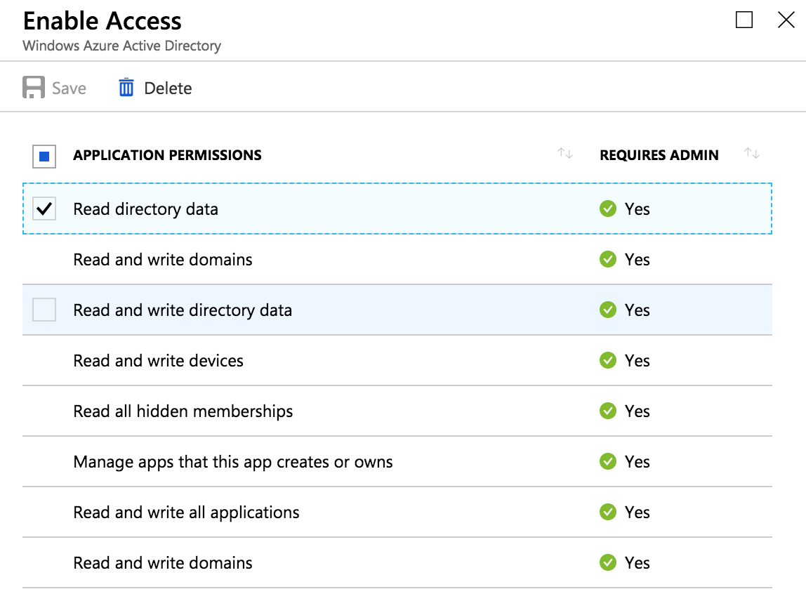

# AAD B2C user API


In the AAD Blade (not B2C Blade) of the B2C Tenant, a new app registration needs to be created with the permission to read directory data.



You need to supply the App ID and the key of this app registration along with the tenant name as environment variables to the service:

- B2C_CLIENT_ID=your_app_registration_id
- B2C_CLIENT_SECRET=your_app_registration_key
- B2C_TENANT_DOMAIN=yourb2ctenant.onmicrosoft.com

## Group membership

This service listens on `/getGroupMembership/` and takes a JSON body with claims from the Azure AD B2C Identity Experience Framework. Configure the RESTful API of you custom policy's user journey in a way that when a user logs in, this service here gets POSTed the claim in the format:

```json
{
    "objectId": "1111aaaa-22bb-1111-aabb-123456abcdef"
}
```

Based on the objectId in the body, the service will call the Azure AD Graph API user endpoint `getMemberGroups` and return a list of AAD group object IDs the user is part of. The B2C IEF custom policy in turn puts those groups as a claim into the id_token that is sent back to the application.

Example with cURL:

POST the endpoint with the objectId claim in the JSON body:

```
# local docker example:

curl -X POST http://localhost:8080/getGroupMembership/ -d '{"objectId": "1111aaaa-22bb-1111-aabb-123456abcdef"}'
```

## Authentication

The service itself doesn't include any builtin authentication. For public deployments, you should ensure that you have a reverse proxy in front that handles authentication. The AAD B2C RESTful API feature supports [Basic auth](https://docs.microsoft.com/en-us/azure/active-directory-b2c/active-directory-b2c-custom-rest-api-netfw-secure-basic) & [Certificate auth](https://docs.microsoft.com/en-us/azure/active-directory-b2c/active-directory-b2c-custom-rest-api-netfw-secure-cert)

